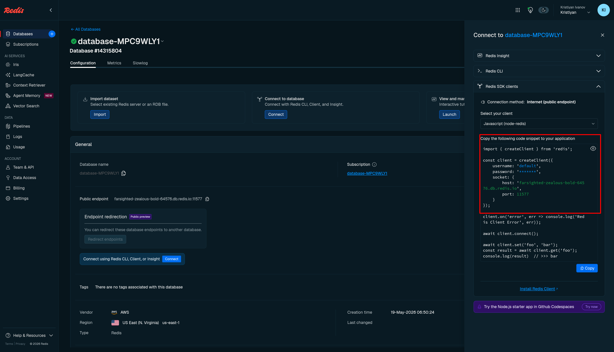
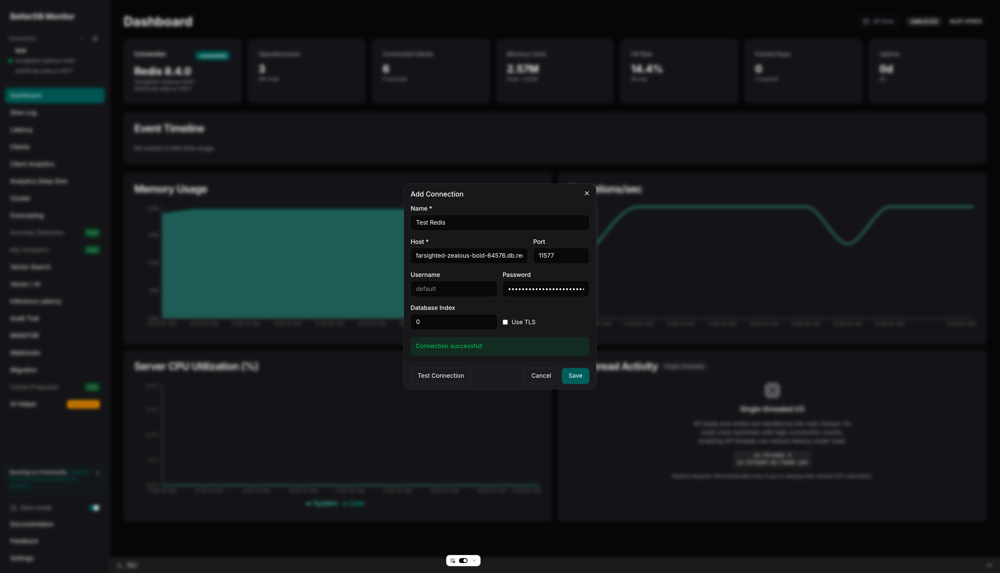

# Connecting BetterDB to Redis Cloud

Redis Cloud is Redis's managed cloud offering. It exposes a public endpoint on a non-standard port, so BetterDB connects to it directly - no agent required.

## Prerequisites

- A Redis Cloud account with at least one database created
- BetterDB Cloud workspace, or self-hosted BetterDB

## Finding Your Connection Details

1. Open the [Redis Cloud console](https://app.redislabs.com) and select your database
2. You land on the **Configuration** tab by default
3. In the **General** section, find the **Public endpoint** field - it contains the host and port together, e.g. `farsighted-zealous-bold-64576.db.redis.io:11577`
4. To find your password, click **Connect** at the top of the page, expand **Redis SDK clients**, and look for the `password` field in the code snippet



> The host and port are always shown together in the **Public endpoint** field separated by a colon. Split them when filling in the BetterDB form.

## Connecting via BetterDB Cloud

1. In BetterDB Cloud, open the connection selector and click **+ Add Connection**
2. Fill in the form:

   | Field | Value |
   |-------|-------|
   | **Host** | The hostname from the public endpoint, e.g. `farsighted-zealous-bold-64576.db.redis.io` |
   | **Port** | The port from the public endpoint, e.g. `11577` |
   | **Username** | `default` |
   | **Password** | Your database password (from the Connect panel) |
   | **Use TLS** | Only if your database has TLS enforced (check the Security section) |

3. Click **Test Connection**, then **Save**



## Connecting Self-Hosted BetterDB

### Via environment variables (initial connection)

```bash
docker run -d \
  --name betterdb \
  -p 3001:3001 \
  -e DB_HOST=farsighted-zealous-bold-64576.db.redis.io \
  -e DB_PORT=11577 \
  -e DB_USERNAME=default \
  -e DB_PASSWORD=your-database-password \
  -e BETTERDB_LICENSE_KEY=your-license-key \
  betterdb/monitor
```

Add `-e DB_TLS=true` if your database has TLS enforced.

### Via API (additional connections)

```bash
curl -X POST http://localhost:3001/connections \
  -H "Content-Type: application/json" \
  -d '{
    "name": "Redis Cloud Production",
    "host": "farsighted-zealous-bold-64576.db.redis.io",
    "port": 11577,
    "username": "default",
    "password": "your-database-password"
  }'
```

## What Works on Redis Cloud

| Feature | Status | Notes |
|---------|--------|-------|
| Memory & CPU metrics | ✅ | Via `INFO` command |
| Key count, ops/sec, hit rate | ✅ | Via `INFO` |
| Slowlog | ✅ | Available on all plans |
| Key analytics (SCAN) | ✅ | SCAN is supported |
| Anomaly detection | ✅ | Based on INFO polling |
| Webhooks & alerts | ✅ | |
| Migration (source or target) | ✅ | All data types supported |
| Client analytics | ✅ | `CLIENT LIST` is supported |
| MONITOR stream | ⚠️ | Availability depends on plan; BetterDB probes on connect |
| ACL audit trail | ⚠️ | `ACL LOG` availability varies by plan |
| CONFIG inspection | ⚠️ | `CONFIG GET` is available on some plans but not all |
| COMMANDLOG | ❌ | Valkey-only feature; not available on Redis Cloud |

BetterDB detects unavailable commands automatically - restricted panels show an explanation rather than an error.

*Feature availability on managed providers changes frequently. Always consult the [Redis Cloud documentation](https://redis.io/docs/latest/operate/rc/) for the most up-to-date information on supported commands.*

## Known Limitations

**Non-standard port.** Redis Cloud assigns a unique high port to each database (e.g. `11577`). Make sure to copy the full `host:port` from the **Public endpoint** field and split them into the separate Host and Port fields in BetterDB.

**Single database only.** Redis Cloud does not support multiple Redis databases (`SELECT 1`, `SELECT 2`, etc.). All data lives in database `0`. BetterDB connects to database `0` by default.

**TLS varies by plan.** TLS is optional on some plans and enforced on others. Check your database's **Security** section to confirm whether TLS is required before connecting.

## Troubleshooting

| Symptom | Cause | Fix |
|---------|-------|-----|
| `Connection refused` | Wrong port | Copy the full public endpoint from the Configuration tab and use only the port number after the colon |
| `WRONGPASS invalid username-password pair` | Wrong password or username | Use `default` as the username and the password from the Connect panel |
| `Connection timed out` | TLS mismatch | If TLS is enforced on the database, enable **Use TLS** in the connection form |
| Dashboard panels show "Unavailable" | Command restricted by Redis Cloud | Expected - see the [feature table](#what-works-on-redis-cloud) above |
| MONITOR tab is empty or unavailable | Plan does not support MONITOR | Upgrade your Redis Cloud plan or use polling-based metrics instead |
