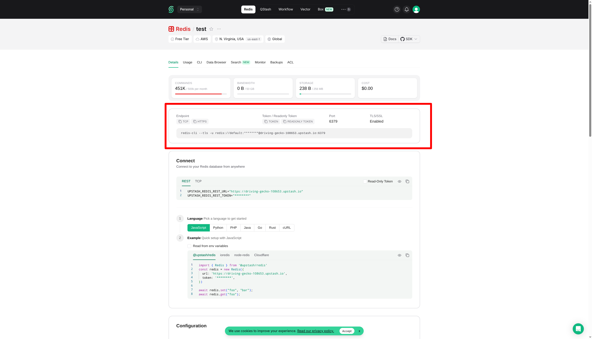
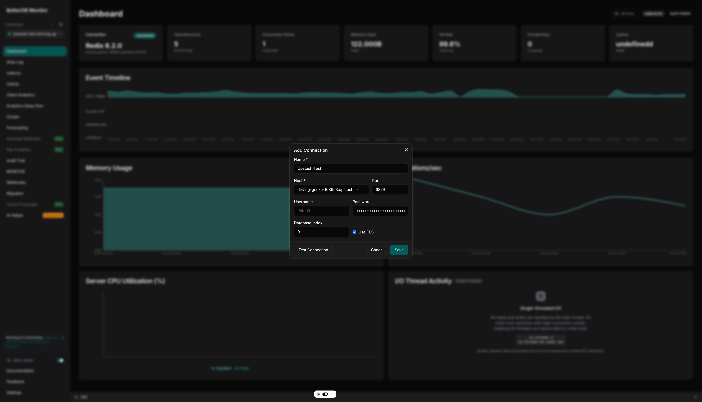

# Connecting BetterDB to Upstash

Upstash is a serverless Redis/Valkey provider. It uses the standard Redis wire protocol on port 6379 with TLS, so BetterDB connects to it directly - no agent required.

## Prerequisites

- An Upstash account with at least one Redis or Valkey database created
- BetterDB Cloud workspace, or self-hosted BetterDB

## Finding Your Connection Details

1. Open the [Upstash Console](https://console.upstash.com)
2. Select your database - you land on the **Details** tab by default
3. At the top of the Details tab, find the connection info block showing **Endpoint**, **Token / Readonly Token**, **Port**, and **TLS/SSL**:
   - **Endpoint** - click **TCP** to see the hostname, e.g. `your-db.upstash.io`
   - **Token** - click **TOKEN** to copy it - this is your password
   - **Port** - `6379`
   - **TLS/SSL** - `Enabled` (always required)



> The **Connect** section further down the page shows `UPSTASH_REDIS_REST_URL` and `UPSTASH_REDIS_REST_TOKEN` - these are for the HTTP REST API and **will not work** with BetterDB. Use the **Token** from the top block instead.

## Connecting via BetterDB Cloud

Direct connection works because Upstash exposes its endpoint publicly on port 6379.

1. In BetterDB Cloud, open the connection selector and click **+ Add Connection**
2. Fill in the form:

   | Field | Value |
   |-------|-------|
   | **Host** | `your-db.upstash.io` |
   | **Port** | `6379` |
   | **Password** | Your Upstash **Token** (from the Details tab top block) |
   | **Username** | *(leave blank or `default`)* |
   | **Use TLS** | ✅ Enabled |

3. Click **Test Connection**, then **Save**



## Connecting Self-Hosted BetterDB

### Via environment variables (initial connection)

```bash
docker run -d \
  --name betterdb \
  -p 3001:3001 \
  -e DB_HOST=your-db.upstash.io \
  -e DB_PORT=6379 \
  -e DB_PASSWORD=your-upstash-token \
  -e DB_TLS=true \
  -e BETTERDB_LICENSE_KEY=your-license-key \
  betterdb/monitor
```

### Via API (additional connections)

```bash
curl -X POST http://localhost:3001/connections \
  -H "Content-Type: application/json" \
  -d '{
    "name": "Upstash Production",
    "host": "your-db.upstash.io",
    "port": 6379,
    "password": "your-upstash-token",
    "tls": true
  }'
```

## What Works on Upstash

| Feature | Status | Notes |
|---------|--------|-------|
| Memory & CPU metrics | ✅ | Via `INFO` command |
| Key count, ops/sec, hit rate | ✅ | Via `INFO` |
| Slowlog | ✅ | Available on all plans |
| Key analytics (SCAN) | ✅ | SCAN is supported |
| Anomaly detection | ✅ | Based on INFO polling |
| Webhooks & alerts | ✅ | |
| Migration (source or target) | ✅ | All data types supported |
| MONITOR stream | ✅ | Supported by Upstash |
| Client analytics | ✅ | `CLIENT LIST` is supported |
| ACL audit trail | ⚠️ | `ACL LOG` availability varies by plan; the audit tab may show no entries |
| CONFIG inspection | ❌ | `CONFIG GET/SET` is not available on Upstash |
| COMMANDLOG | ❌ | Valkey-only feature; not available on Upstash Redis |

BetterDB detects unavailable commands automatically - restricted panels show an explanation rather than an error.

*Feature availability on managed providers changes frequently. Always consult the [Upstash documentation](https://upstash.com/docs) for the most up-to-date information on supported commands.*

## Known Limitations

**Single database only.** Upstash does not support multiple Redis databases (`SELECT 1`, `SELECT 2`, etc.). All data lives in database `0`. BetterDB always connects to database `0` by default, so this is not an issue unless you explicitly set a different database number.

**No CONFIG access.** Upstash does not allow `CONFIG GET` or `CONFIG SET`. The configuration panel in BetterDB will be unavailable for Upstash connections.

## Troubleshooting

| Symptom | Cause | Fix |
|---------|-------|-----|
| `Connection refused` on port 6379 | TLS not enabled | Enable **Use TLS** in the connection form |
| `WRONGPASS invalid username-password pair` | Wrong token | Use the **Token** from the top connection block on the Details tab - not `UPSTASH_REDIS_REST_TOKEN` from the Connect section below |
| `ERR unknown command 'CONFIG'` | Upstash blocks CONFIG | Expected - BetterDB handles this automatically |
| Dashboard panels show "Unavailable" | Command restricted by Upstash | Expected - see the [feature table](#what-works-on-upstash) above |
| Slowlog is empty | No slow queries yet | Run some operations and check back, or lower `slowlog-log-slower-than` - though `CONFIG SET` is blocked, so this must be set at database creation time via Upstash support |
